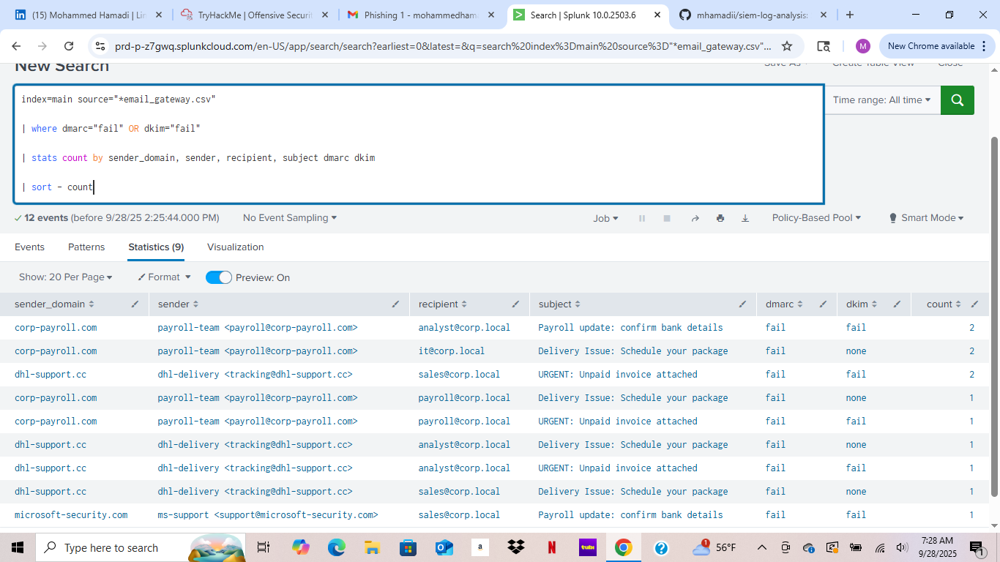
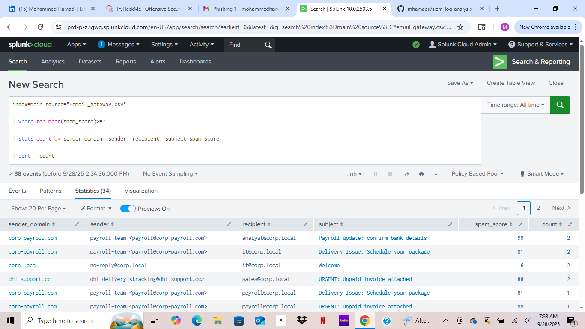
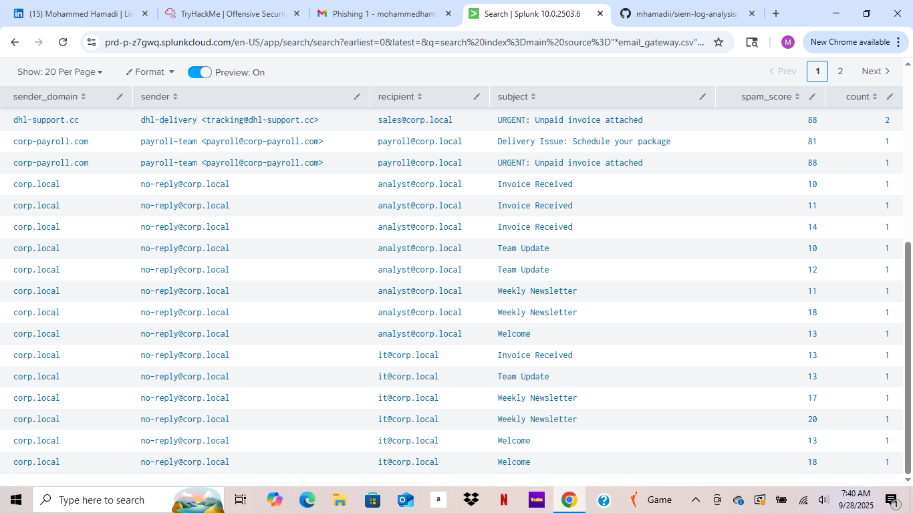
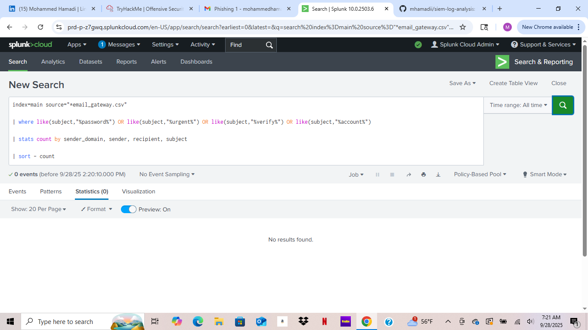
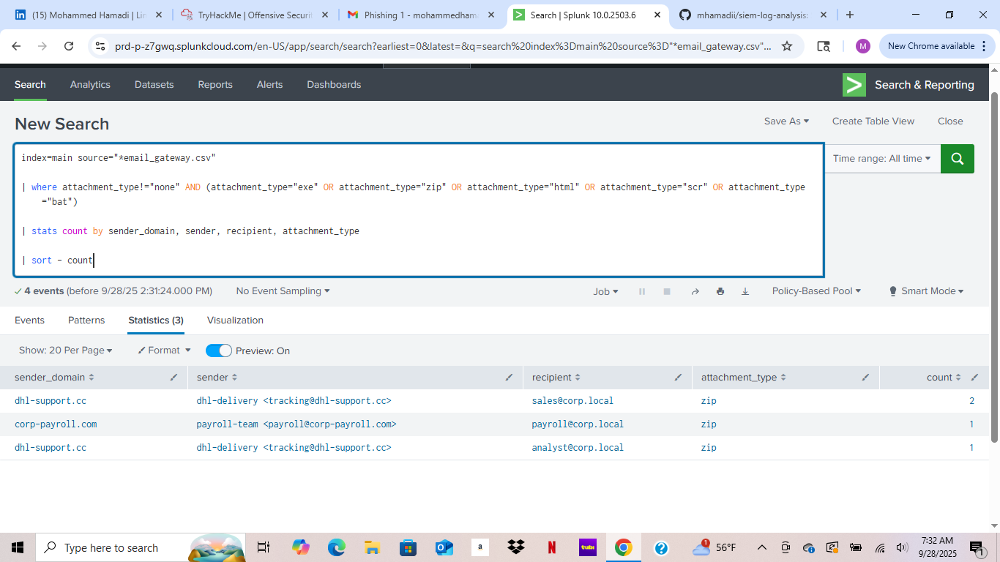

# SIEM Log Analysis — Brute Force & Phishing

This project demonstrates how to detect **brute-force SSH login attempts** and **suspicious phishing emails** using **Splunk**.  
It includes sample log data, custom queries, visualizations, and a lightweight triage playbook.  
The goal is to showcase **SIEM log analysis, threat detection, and investigation skills** for a real-world scenario.  

---

## Files
- **data/**
  - `linux_ssh_logins.csv` — Sample SSH login attempts log
  - `email_gateway.csv` — Sample email gateway log
- **queries/**
  - `splunk/ssh_bruteforce.spl` — Brute-force detection (Splunk SPL)
  - `splunk/phishing.spl` — Phishing detection (Splunk SPL)
  - `elastic/ssh_bruteforce.kql` — Brute-force detection (Elastic KQL)
  - `elastic/phishing.kql` — Phishing detection (Elastic KQL)
- **docs/**
  - `triage-playbook.md` — Step-by-step triage guidance
  - `screenshots/` — Search queries and detections in Splunk

---

## Quick Run

1. **Upload logs into Splunk**
   - Go to *Add Data → Upload*  
   - Upload both CSVs (`linux_ssh_logins.csv`, `email_gateway.csv`)

2. **Run the saved searches**
   - Brute force detection (SSH)  
   - Phishing detection (suspicious emails)

3. **Visualize the data**
   - Build dashboards:  
     - Top IPs  
     - Timechart of login failures/successes  
     - Suspicious email tables

4. **Review detections**
   - Use the queries provided  
   - Correlate events with DMARC/DKIM, spam score, suspicious attachments, and subject line patterns  

---

## Screenshots

### Brute Force Detection

### Phishing Detection — Auth Checks (DMARC/DKIM)

### Phishing Detection — High Spam Score
  

### Phishing Detection — Suspicious Subjects

### Phishing Detection — Suspicious Attachments

---

## Triage Playbook (Quick Guide)

- **Step 1: Brute Force**
  - Investigate source IPs with multiple failed logins  
  - Check if any attempt succeeded after many failures  
  - Correlate with threat intel feeds

- **Step 2: Phishing**
  - Identify emails failing DMARC/DKIM checks  
  - Flag high spam scores (>7) for manual review  
  - Investigate suspicious subjects (e.g., “URGENT”, “Password”)  
  - Check for dangerous attachments (`.exe`, `.zip`, `.scr`, `.bat`)

- **Step 3: Escalation**
  - Escalate confirmed malicious events to SOC team  
  - Recommend blocking sender domain / quarantining attachments  

---

## Skills Demonstrated
- Splunk SPL & Elastic KQL queries  
- SIEM log ingestion & analysis  
- Detection engineering (brute force, phishing)  
- Dashboard building for SOC visibility  
- Writing triage playbooks for incident response  

---

## Author
**Mohammed Hamadi**  
- Google Cybersecurity Professional Certificate | CompTIA Security+ | CS50 Cybersecurity  
- 📂 [GitHub Portfolio](https://github.com/mhamadii)  
- 💼 [LinkedIn](https://www.linkedin.com/in/mohammedhamadi/)  